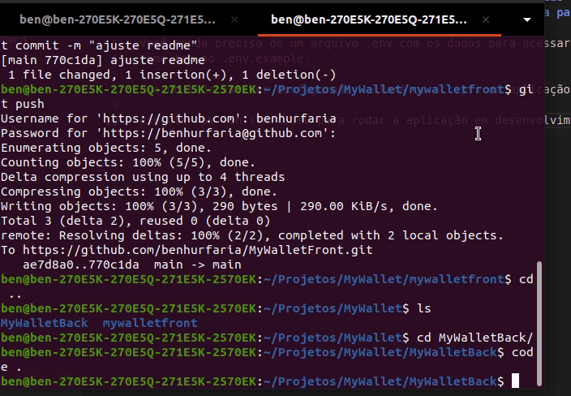

# MYWALLET

### Igualmente ao front, você precisa instalar as dependencias com npm install, mas ainda precisa rodar os scripts do dump do banco disponibilizado na pasta database

Você ainda precisa de um arquivo .env com os dados para acessar o banco
como tem no .env.example.

Quando tudo estiver configurado, estará os scripts da aplicação no package.json

execute npm run start:dev para rodar a aplicação em desenvolvimento

E assim teremos nosso servidor rodando na porta 4000
e podemos usar nosso frontend